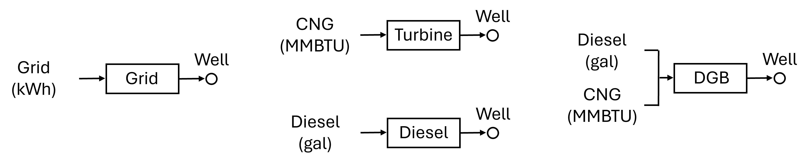
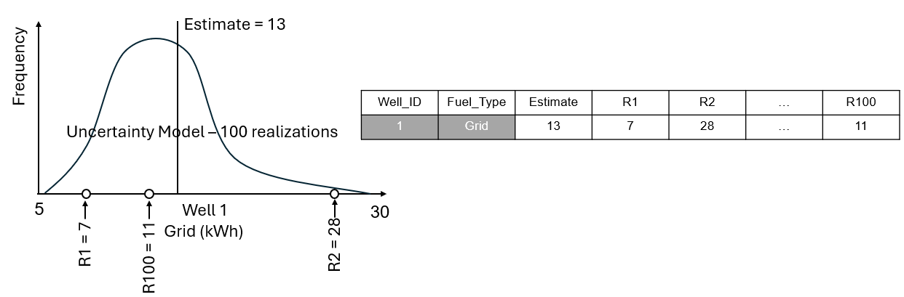

# Energy A.I. Hackathon 2025, the Fifth Annual Event

## Hosts: [Prof. Michael Pyrcz](https://x.com/GeostatsGuy) and [Prof. John T. Foster](https://x.com/johntfoster)

### Architects: [Ahmed Merzoug](https://www.linkedin.com/in/ahmed-merzoug/) and [Elnara Rustamzade](https://www.linkedin.com/in/elnara-rustamzade-779396162/)

### Home Department Chair and Hackathon Supporter: [Prof. Matthew Balhoff](https://www.linkedin.com/in/matthew-balhoff-4297b247/)

### Special Appreciation to [Amy Rueve](https://www.linkedin.com/in/amyrueve/) and [ExxonMobil](https://corporate.exxonmobil.com/) for providing the data set for this year's problem. 

### Sponsors 

Platinum:
[Phillips66](https://www.phillips66.com/), [Chevron](https://www.chevron.com), [ConocoPhillips](https://www.conocophillips.com/)

Silver:
[Shell](https://www.shell.us/), [ExxonMobil](https://corporate.exxonmobil.com/), [Aramco Americas](https://americas.aramco.com/en)

Bronze:
[Elk Range Roylaties]()

### Coordination and Student Engagement: Rowan Halliday, Heba Abdel-Rahim, Gabby Banales, and Stacia Miller

### Appreciation to the Hildebrand Department of Petroleum and Geosystems Engineering for their great support of the Energy AI Hackathon 

___

### Energy A.I. Hackathon 2025 Problem Description 

**Goal**: Develop a data analytics and machine learning workflow in Python to:

* Predict **Grid, Diesel, and CNG** energy usage during hydraulic fracturing operation based many possible predictor features for 50 wells. This includes single estimates and an uncertainty model represented by 100 realizations for each well.
 
#### Background

The U.S. shale revolution, driven by horizontal drilling and hydraulic fracturing, has significantly bolstered energy security. Hydraulic fracturing operations require substantial pumping power and energy to inject fluid into the subsurface, enabling access to unconventional resources. This energy can be sourced from various systems, including the electric grid, diesel generators, gas turbines, or dynamic gas blending (DGB) systems.

Effective planning of energy sources and consumption is critical for efficient supply chain management. Insufficient energy can lead to incomplete or suboptimal fracturing jobs, while excessive energy allocation increases operational costs without adding value. Accurate forecasting of energy requirements allows supply chain teams to optimize resources, minimize costs, and ensure seamless execution of hydraulic fracturing operations.

In order to forcast energy usage we challenge the Energy A.I. Hackathon 2025 teams of The University of Texas at Austin to build a data analytics and machine learning workflow to predict consumed energy Grid,	Diesel, and	CNG with uncertainty.

This will require:

* data analytics and evaluation of multiple data sources over a variety of features
* feature engineering including feature selection, feature transformations, and feature imputation to address missing data
* integration of domain expertise at every step
* selection, training and tuning of robust machine learning prediction models  

Your model will be applied to support forecasting of energy use to support optimum well site selection and well parameters to reduce energy use. 
___

### Available Data Files Inventory

You have the following available data:

#### Well Data

* **[HackathonData2025.csv](HackathonData2025.csv)** - data for 1083 unique wells.
  
The features include:
| Features  | Description |
| ------------- | ------------- |
| **Well Name** | Name of each well. Note that if wells have the same name they do belong to same pad |
| **# Stages** | The number of stages for a hydraulic fracturing operation |
| **# Clusters** | The number of clusters where fractures are initiated (also represent the total number of fractures)  |
| **Estimated Average Stage Time (mins)** | The estimated average time to complete one stage hydraulic fracturing operation |
| **Actual Average Stage Time (mins)** | The actual average time to complete one stage hydraulic fracturing operation |
| **Frac Fleet** | The fleet or service company used for hydraulic fracturing operation |
| **Target Formation** | The formation where the well is landed and to be hydraullically fractured |
| **Field Area** | The field name, this is a spatial indicator for wells that are located at close locations |
| **Ambient Temperature (F)** | The temperature on the day of the hydraulic fracturing operation  |
| **Grid (kWh)** | Amount of grid-based energy consumed from the grid in kilowatt-hours |
| **Diesel (gal)** | Amount of diesel-based energy consumed by diesel generator or the dynamic gas blending system in gallons |
| **CNG (MMBTU)** | Amount of compress natural gas-based energy consumed by the turbine or the dynamic gas blending system |
| **Fuel Type** | The type of system used for generating energy, turbine (compress natural gas in metric million British thermal units), grid (grid in kilowatt-hours), diesel (generator in gallons) and dynamic gas blending (DGB diesel in gallons and compressed natural gas in compress natural gas in metric million British thermal units) |
| **Sand Provider** | The company that provided sand to be pumped into the well |

More details about all the features were provided by the company in this file [Data_Description2025.pdf](Data_Description2025.pdf).

Here's an illustration of the systems for each fuel type,

<figure style="text-align: center;">
  
  <figcaption style="text-align: center;"> The systems for each fuel type.
</figcaption>
</figure>

#### Problem Set
* **[testing.csv](testing.csv)** is the test set you will use to make predictions
* **[solution.csv](solution.csv)** is the format that you will report results in

The solution file includes:

* **Well_ID** - anonymized, unique well identifier for the well to be predicted (**provided** - do not change)
* **Fuel_Type** - the fuel type at the specified well (**provided** - do not change)
* **Estimated Energy Use** - the hackathon team's estimate of the amount of energy used in the units of the fuel type 
* **R_** - the hackathon team's 100 realizations for the amount of energy used in the units of the fuel type, for the case of fuel type of DGB there is a row for diesel and another row for compressed natural gas.  

Here's an illustration of the estimate and uncertainty model for a single well,

<figure style="text-align: center;">
  
  <figcaption style="text-align: center;"> Illustration of the estimate and uncertainty model for a single well.
</figcaption>
</figure>

Replace the -999 values with you solutions. Note, do not change the column titles, nor the number of columns or rows of the solution file. Any changes to the file format will prevent your solution from being scored. The file is a comma delimited file.
  
##### Comments: 

* all the well names are anonymized (replaced with simple indices).
* NaN in the file indicate missing data.
* the source of the data is confidential. Do not attempt to determine the source of the data.

___

### Required Hackathon Submissions

By January 26 at 12:00 noon each team must submit:

* **Solution Table** - a .csv file with your predictions (estimates and uncertainty) for the 50 wells using the template given in [solution.csv](solution.csv) in this directory.

    * the file must be named `solution.csv` with final values in a commit and then pushed to Github for automated scoring.

* **Python Workflow and Associated Files** - committed to this repository with the workflow as a Jupyter Notebook `.ipynb` file along with all data files required to reproduce your team's solutions. The submitted workflow Jupyter Notebook should follow the format of the provided template [Hackathon_ProjectTemplate](Hackathon_ProjectTemplate.ipynb) for enhanced workflow communication and code readibility.

    * the file must be named `xxxx.ipynb` and pushed to GitHub for review and scoring (for code readability) by the hackathon architects, where **xxxx** is your team name.

* **Presentation** - a PowerPoint slide deck .PPTX file for your team's final presentation to our judges. The submitted presentation should follow the format of the provided example presentation [Hackathon_PresentationTemplate](Hackathon_PresentationTemplate.pptx).

    * the file must be named `xxxx.pptx` and pushed to GitHub for review by the judges, where **xxxx** is your team name.

    * **YOU MUST INCLUDE ALL TEAM PARTICIPANTS NAMES ON YOUR PRESENTATION TITLE SLIDE**

Use the [solution.csv](solution.csv) file (in this directory) to record your solution.
